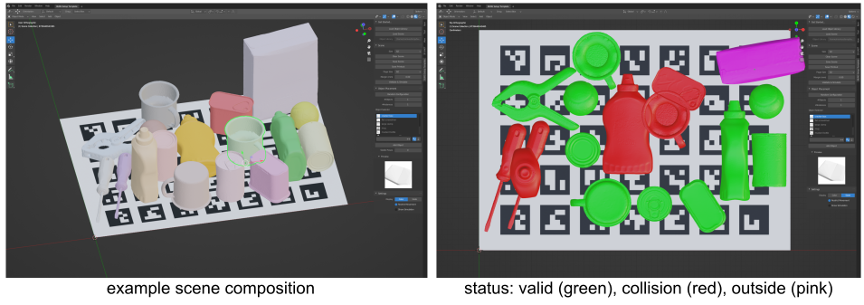
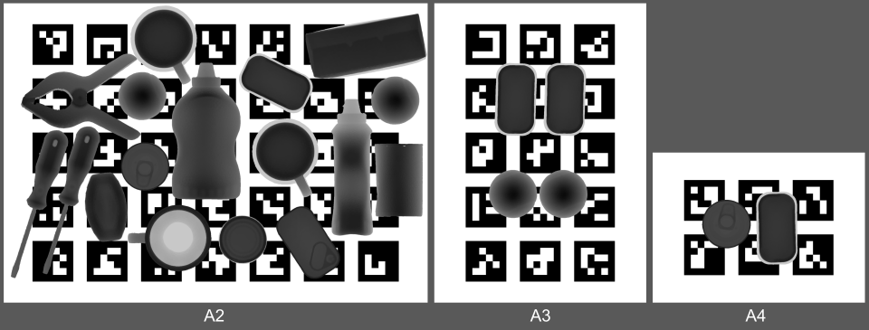

# BURG SetupTool for BURG toolkit

This tool provides an easy way to compose table top scene arrangements in blender. The created scenes are used to provide printable reproducible startup object configurations for grasping experiments.
The application is a front end of the [BURG toolkit](https://github.com/mrudorfer/burg-toolkit/) library for **B**enchmarking and **U**nderstanding **R**obotic **G**rasping, developed 
in the scope of [BURG project](#references).
It provides the following features:
- ability of creating/loading/saving scenes
- adding/removing/manipulating objects
- validating layouts using physics simulation
- creating printable templates for your experiments

The left image shows an example scene created with the tool. Right image shows color coded status results of objects after validation.


Printable pdf files can be saved to 3 available page sizes (A2, A3, A4), and can be split up if needed (eg. A2 -> 2 x A3).



## installation of BURG SetupTool

### install blender

We specifically require version 2.92. Other versions unfortunately do not work, due to compatibility issues.

Download and extract blender 2.92:
```
cd ~
wget https://download.blender.org/release/Blender2.92/blender-2.92.0-linux64.tar.xz
tar -xf blender-2.92.0-linux64.tar.xz
rm blender-2.92.0-linux64.tar.xz
```

If you extract to any other location you will need to adjust the paths accordingly throughout these installation instructions.

Optionally, you can make blender callable from the app menu and/or from the command line. Note that you only see console outputs when you start it from command line. However, seeing these outputs is generally not required and only useful for debugging.

Make blender callable in the app menu:
- Open `~/blender-2.92.0-linux64/blender.desktop`, change entries:
	- `Exec=/home/username/blender-2.92.0-linux64/blender %f`
	- `Icon=/home/username/blender-2.92.0-linux64/blender.svg`
	-rk `Name=Blender292`
- `cp ~/blender-2.92.0-linux64/blender.desktop ~/.local/share/applications`

Make blender callable in the command line:
- `sudo ln -s ~/blender-2.92.0-linux64/blender /usr/local/bin/blender292`

### install setup tool as blender addon

Clone the repository, add it to blender add ons:
```
cd ~
git clone --recursive git@github.com:markus-suchi/burg-setuptool.git
cd blender-2.92.0-linux64/2.92/scripts/addons
ln -s ~/burg-setuptool/ burg-setuptool
```

Install dependencies in blender python:
```
cd ~/blender-2.92.0-linux64/2.92/python/bin
./python3.7m -m ensurepip
./python3.7m -m pip install --upgrade pip
./python3.7m -m pip install --upgrade setuptools wheel
./python3.7m -m pip install ~/burg-setuptool/burg-toolkit['collision']
```

#### activate the blender addon
- Start blender, either from command line (see debug outputs) or from the app menu, as configured before
- Open "Edit" -> "Preferences..."
- Go to "Add-ons", activate "Testing" tab at the top
- Click on the checkbox to activate "User Interface: BURG-SetupTool" and close preferences

This concludes the installation.

### upgrade

If you want to upgrade to a new version, these steps are required:
```
# fetch changes to gui and toolkit
cd burg-setuptool
git pull
git submodule update --recursive

# rebuild toolkit
cd ~/blender-2.92.0-linux64/2.92/python/bin
./python3.7m -m pip install ~/burg-setuptool/burg-toolkit['collision']
```

## usage

### general
- Choose "File" -> "New" -> "BURG SetupTool"
- In the main window to the top right expand the Property Window
- Select "BURG Setup Template" to see the addon menu

Get started by:
- Opening an object library yaml file and then composing scenes, or
- Importing a scene, which automatically loads an object library 

As an example, you can download an object library and two scenes in [setuptool-examples.zip](https://drive.google.com/file/d/17CqIyr3KndNl3fT2dXhQrDfgaNAT0mxz/view?usp=drivesdk) [10.4MB].
The two objects are borrowed from the [YCB dataset](http://ycb-benchmarks.s3-website-us-east-1.amazonaws.com/).

Rotating the view:
- use num pad to rotate
- click and hold on the coordinate system at the top right corner to rotate

### creating your own object library

To use the SetupTool, an object library is needed.
Object libraries are stored as human-readable YAML files.
You can either create them in editor, or via API of the burg toolkit.

#### file structure of object_library.yaml
The base template looks like this:

```
---
yaml_file_type: "ObjectLibrary"
yaml_file_version: "1.0"
name: "My Object Library"
description: "This library illustrates how to use object libraries."
objects:
  -
    identifier: 003_cracker_box
    name: cracker box
    mesh_fn: 003_cracker_box/google_16k/textured.obj
    mass: 0.411
    friction_coeff: null
  -
    identifier: 005_tomato_soup_can
    name: tomato soup can
    mesh_fn: 005_tomato_soup_can/google_16k/textured.obj
    mass: 0.349
    friction_coeff: null
```

Explanation:
- `yaml_file_type` and `yaml_file_version` are required for the file to be recognised
- `name` and `description` are arbitrary strings to describe your lib
- the list of `objects` is where you add your data:
    - `identifier` must be unique for each object
    - `name` optional, more descriptive name
    - `mesh_fn` relative path to the mesh file (currently only .obj is supported)
    - `mass` in kg; note that if this is not given it will be initialised to 0 which will cause the simulation 
to treat it as fixed in space; this must be avoided except for environmental objects (table, shelf)
    - `friction_coeff` lateral friction coefficient that will be used in simulation; defaults to 0.24 if not given
    - `thumbnail_fn`, `vhacd_fn`, `urdf_fn` and `stable_poses` are attributes that are usually created by the burg toolkit and do not need to be provided

Unused fields can either be provided with `null` values or left out.
After loading this simple object library in the SetupTool, it will create the missing data.
This may take a while, around 5-10 seconds per object. Grab a coffee for larger object libraries.

Paths are relative to the YAML file (both for object library and scene files).
It is recommended that you create a directory for your object library and place everything related (i.e. the mesh
files and the library.yaml) inside.
Generated files will be created in sub-directories per default.
This way, you can move the object library to different directories/machines simply by copying the whole folder.
However, be aware that if you move individual files, the references break and need to be fixed manually.

#### creating object library via API

BURG toolkit provides a class to create an object library from the YCB dataset.

```
import os
import burg_toolkit as burg

ycb_path = '/path/to/YCB/dataset'
reader = burg.io.YCBObjectLibraryReader(base_path=ycb_path, model_type='google_16k', model_fn='textured.obj')
lib = reader.read_object_library()

# assign (random) mass so that objects will not be fixed in space
# you can do better and put actual masses
for name, object_type in lib.items():
	object_type.mass = np.random.uniform(0.1, 0.7)

# save to file
lib.to_yaml(os.path.join(ycb_path, 'object_library.yaml'))
```

You can then proceed to generate all further attributes as follows:

```
lib.compute_all_attributes()  # takes long time
lib.to_yaml()  # saves to same file as above
```

## Acknowledgments

This work was conducted within the BURG research project for Benchmarking and Understanding Robotic Grasping. 
It is supported by CHIST-ERA and the Austrian Science Foundation (FWF) grant no. I3967-N30 BURG.

## References

### research

- BURG research project: https://burg.acin.tuwien.ac.at/`
